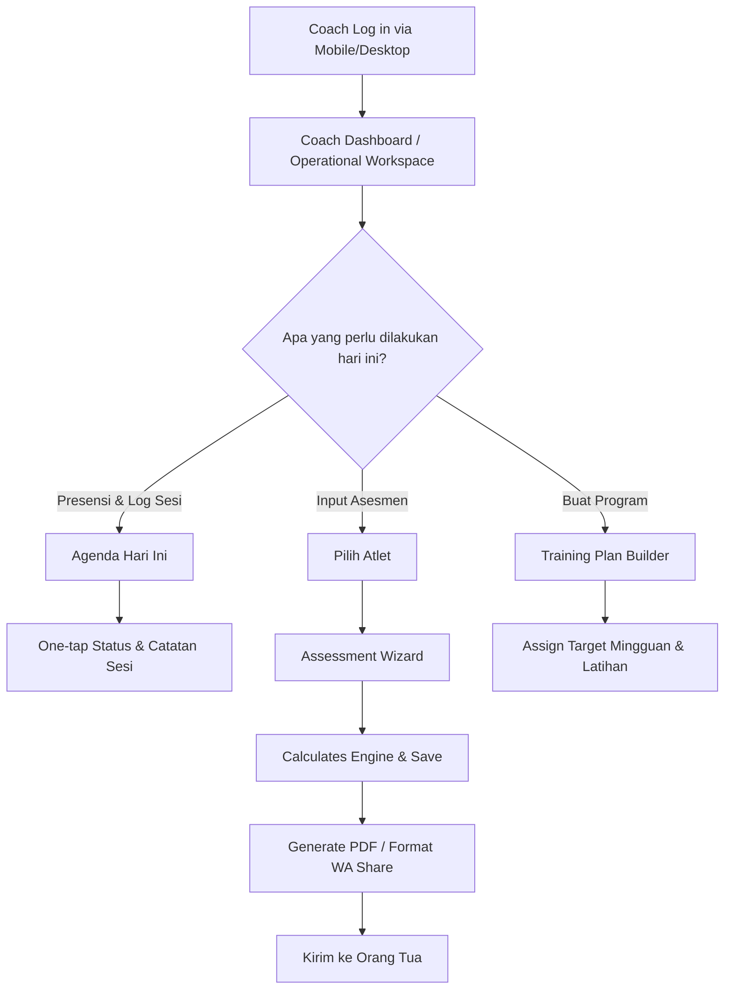
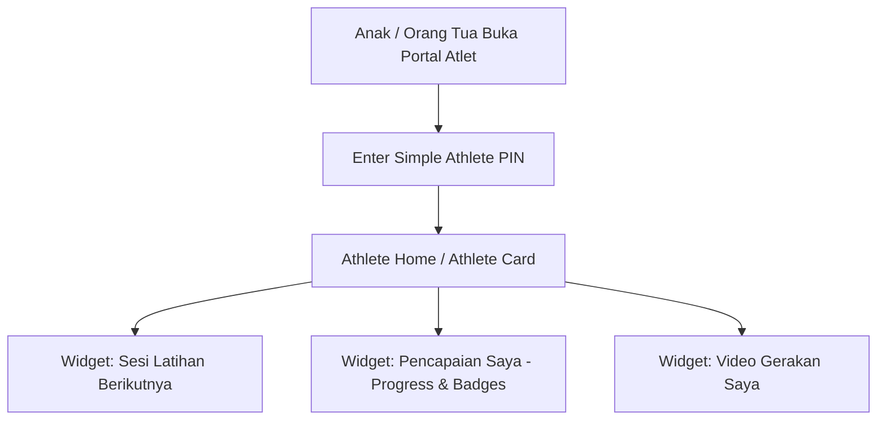
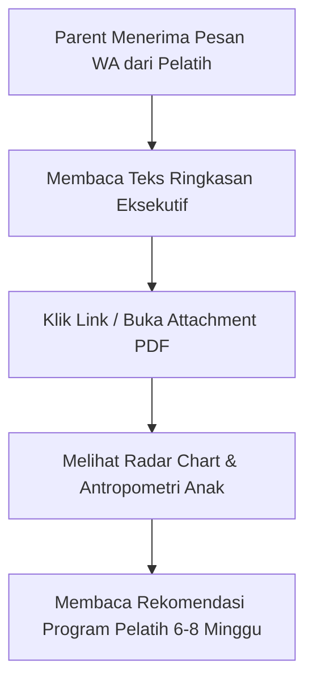

# PHASE 2 & 2.1 — PRODUCT BLUEPRINT & UX ARCHITECTURE

**Product:** Sports Performance & Athlete Development Platform  
**Working Name:** Kinetiq / Power Up Private Training *(Naming decision — deferred)*  
**Author:** Senior Product Manager, Lead UX Architect, & Technical Lead  
**Date:** 14 August 2026 (Updated Phase 2.1 Revision)  
**Status:** Validated Blueprint (Single Source of Truth for Phase 3)

---

## 1. Product Definition

### Product Purpose
Platform ini adalah **Sistem Ekosistem Pelatihan Performa Olahraga (Sports Performance & Athlete Development System)** yang dirancang untuk menjembatani operasional harian pelatih (*Coach*), motivasi pengembangan atlet anak usia 6–14 tahun (*Athlete*), dan transparansi hasil perkembangan bagi orang tua (*Parent*).

### Primary Problem
1. **Bagi Coach**: Pengelolaan jadwal latihan, penyusunan program, dan pencatatan hasil asesmen fisik masih manual (berbasis Excel dan pesan WhatsApp yang tercecer), menyita waktu 2–3 jam per minggu untuk administrasi operasional.
2. **Bagi Athlete (Anak 6–14 Tahun)**: Data evaluasi fisik dan jadwal latihan disajikan dalam bentuk tabel angka teknis yang membosankan dan membingungkan, sehingga tidak memicu motivasi internal anak untuk berkembang.
3. **Bagi Parent**: Kurangnya visibilitas perkembangan fisik dan kesehatan anak dari waktu ke waktu secara terukur, transparan, dan profesional.

### Target Users
1. **Coach (Head Coach & Assistant Coach)**: Membutuhkan *operational workspace* yang cepat, efisien di lapangan, dan task-oriented.
2. **Athlete (Anak Usia 6–14 Tahun)**: Membutuhkan *personal performance experience* yang bernuansa **Youthful Sports Performance** — visual, aspiratif, memotivasi, dan mudah dipahami tanpa terasa seperti aplikasi anak-anak prasekolah.
3. **Parent (Orang Tua)**: Membutuhkan *report/communication experience* yang jelas, mudah diakses via WhatsApp/PDF, dan terpercaya tanpa perlu mengelola dashboard administrasi yang rumit.

### Value Proposition
* **Untuk Coach**: Menghemat waktu operasional hingga 80% dengan automatisasi pembuatan laporan PDF, kalkulasi *assessment engine*, dan pemantauan jadwal terpadu.
* **Untuk Athlete**: Mengubah angka statistik menjadi *"Personal Performance Profile / Athlete Card"* yang membanggakan, memicu motivasi, dan menegaskan identitas atletik diri.
* **Untuk Parent**: Laporan resmi bertaraf profesional yang memperlihatkan bukti perkembangan fisik dan kesehatan anak secara transparan.

### Primary User Outcomes
* **Coach**: Dapat menginput hasil tes 1 atlet dalam < 2 menit dan membuat laporan PDF dalam 1 klik.
* **Athlete**: Dapat mengecek jadwal latihan berikutnya dan melihat perkembangan bintang/badge prestasinya secara mandiri.
* **Parent**: Memahami kelebihan fisik anak serta rekomendasi latihan dalam kurun 30 detik membaca laporan PDF/WA.

### Business Outcome
* Meningkatkan retensi klien private training.
* Menyiapkan fondasi sistem yang dapat diskalakan dari *private training* (16–30 klien) menuju *group class* terjadwal dalam 1–2 tahun ke depan.

### MVP Objective
Membangun dan meluncurkan sistem operasional task-oriented untuk Coach, portal ramah anak bernuansa *Youthful Sports Performance* untuk Athlete, serta sistem pelaporan PDF/WA untuk Parent tanpa menimbulkan *technical debt* atau scope creep.

### "Produk ini sebenarnya apa?"
> Produk ini adalah **"Kombinasi Buku Saku Operasional Pelatih dan Kartu Prestasi Digital Atlet Anak"**. Untuk pelatih, ia adalah alat kerja cepat yang mengatur jadwal dan menghitung otomatis fisik atlet. Untuk anak-anak, ia adalah ruang prestasi pribadi yang menampilkan foto, jadwal latihan, video gerakan, dan pencapaian fisik mereka dengan tampilan yang sporty, keren, dan memotivasi.

---

## 2. User Roles

### 1. Coach (Head Coach & Assistant Coach)
* **Goals**: Mengatur jadwal sesi harian/mingguan, menyusun program latihan (*Training Plan*), mencatat hasil asesmen fisik (*Assessment*), memberikan evaluasi video, dan mengirimkan laporan (*Report*) ke orang tua.
* **Responsibilities**: Mengelola data atlet, presensi sesi (*Session Log*), reliabilitas input tes fisik, dan menjaga komunikasi profesional dengan orang tua.
* **Main Tasks**:
  * Membuka agenda latihan hari ini di lapangan (Mobile HP).
  * Mengisi presensi & catatan sesi harian (*Session Log*).
  * Menginput data tes fisik (*Assessment*).
  * Mengisi/menyesuaikan *Training Plan* mingguan.
  * Mengunduh/membagikan *Report* PDF & pesan WhatsApp.
* **Information Needed**: Agenda harian terurut waktu, daftar atlet aktif, riwayat cedera atlet, threshold benchmark tes fisik, dan tren perkembangan.
* **Frequency of Use**: Sangat tinggi (setiap hari, berkali-kali di lapangan dan di meja kerja).
* **Important Actions**: *Quick Presensi*, *New Assessment*, *Generate Report*, *Share to WhatsApp*.
* **Pain Points**: Form input yang rumit di layar seluler, tombol kecil yang susah diketik saat di lapangan, dan pembuatan laporan manual yang menyita waktu.

### 2. Athlete (Anak Usia 6–14 Tahun)
* **Goals**: Mengetahui kapan jadwal latihan berikutnya (*Next Training*), melihat *Athlete Card* prestasinya, menonton video contoh gerakan, dan merasa bangga atas perkembangan fisiknya.
* **Main Activities**:
  * Membuka *Athlete Profile* ("Athlete Card").
  * Melihat jadwal "Latihanku Minggu Ini".
  * Melihat badge pencapaian (*Achievements* & *Stars*).
  * Memutar ulang video latihan dari pelatih.
* **Information Needed**: Jam & lokasi latihan berikutnya, nama pelatih, foto diri, statistik visual sederhana (skala 1-5 bintang / indikator progres warna), dan catatan kata motivasi pelatih.
* **Motivation**: Ingin menjadi lebih kuat/cepat, merasa seperti atlet profesional sungguhan, menyukai visual yang keren dan aspiratif.
* **Interaction Limitations**:
  * Motorik halus belum sepresisi orang dewasa (butuh touch target besar min 48px).
  * Rentang perhatian pendek (*short attention span*).
  * Tidak menyukai teks panjang atau tabel angka yang padat.
* **Age Considerations (6–14 Tahun)**:
  * **Arah Desain**: **Youthful Sports Performance**.
  * **PENTING**: TIDAK boleh terasa seperti *children's educational app*, gim kartun TK, atau *toy-like dashboard*. Anak harus merasa *"Ini adalah ruang performa milikku"*, bukan *"Ini aplikasi anak kecil"*.
  * **Usia 6–9 tahun**: Dominan visual tajam, kata-kata motivasi sederhana (misal: *"Speed Master"*), dan navigasi ikon yang jernih.
  * **Usia 10–14 tahun**: Mulai tertarik dengan statistik personal (misal: *"Kecepatan 85%"*), grafik progres garis sederhana, dan video klip gerakan.

### 3. Parent (Orang Tua Klien)
* **Goals**: Mengetahui jadwal anak, memastikan anak berlatih dengan aman, dan melihat bukti nyata perkembangan fisik serta kesehatan anak.
* **Information Needed**: Ringkasan *Overall Score* fisik anak, rekomendasi pelatih 6–8 minggu, catatan kesehatan/antropometri (TB, BB, BMI), dan konfirmasi jadwal sesi.
* **Main Interactions**:
  * Menerima & membuka *Report* PDF di WhatsApp.
  * Membaca pesan ringkasan teks dari pelatih.
* **Communication Needs**: Komunikasi transparan, format laporan yang mudah dipahami dalam 30 detik, tanpa istilah ilmiah rumit yang tidak dijelaskan.

---

## 3. User Goals

```
+-----------------------------------------------------------------------+
|                           KINETIQ PLATFORM                            |
+-----------------------------------+-----------------------------------+
|             OPERATIONAL           |            EXPERIENCE             |
+-----------------------------------+-----------------------------------+
| COACH GOALS:                      | ATHLETE GOALS (6-14 YRS):         |
| - Zero scheduling conflict        | - Know next training time & place |
| - Fast assessment data entry      | - Feel proud of personal stats    |
| - Instant PDF & WA report gen     | - Watch training video clips      |
| - Task-oriented daily execution   | - Earn progress stars & badges    |
|                                   |                                   |
|                                   | PARENT GOALS:                     |
|                                   | - Understand child physical ROI   |
|                                   | - Receive clear WA/PDF reports    |
+-----------------------------------+-----------------------------------+
```

---

## 4. Product & UX Principles

### 1. Performance First
Setiap bagian dari produk harus mencerminkan identitas platform *athlete performance* yang serius, terukur, dan berbasis ilmu keolahragaan — bukan aplikasi manajemen umum.

### 2. Human First
Data dan angka hadir untuk membantu Coach memahami atlet dan mengambil keputusan pelatihan yang tepat. Data bukan pengganti pertimbangan (*judgement*) dan empar pelatih.

### 3. Age Appropriate (Youthful Sports Performance)
Pengalaman Athlete harus disesuaikan dengan usia 6–14 tahun yang memotivasi dan aspiratif, tanpa menjadi anak-anak (*childish*), kekanak-kanakan, atau berbentuk gim kartun.

### 4. Operationally Fast
Coach harus dapat menyelesaikan pekerjaan rutin di lapangan (seperti presensi, catatan harian, input skor) dalam jumlah ketukan layar minimum (< 3 tap).

### 5. Distinctive, Not Decorative
Keunikan visual dan UX produk lahir dari konteks keolahragaan, kekuatan brand, dan struktur konten — bukan dari elemen dekoratif acak, animasi berlebihan, atau tren visual sementara.

### 6. Progressive Disclosure
Tampilkan informasi sesuai konteks dan kebutuhan pengguna pada saat itu. Jangan menjejalkan seluruh statistik teknis sekaligus pada satu layar.

### 7. Mobile-Aware
Seluruh fungsi operasional Coach saat berada di lapangan harus dapat dijalankan secara optimal melalui perangkat seluler berlayar kecil.

---

## 5. User Flows

### Coach Main User Flow (Task-Oriented)


### Athlete Main User Flow (Youthful Performance)


### Parent Main User Flow (Report & Messaging)


---

## 6. Information Architecture

```text
GLOBAL SYSTEM STRUCTURE
│
├── 1. PUBLIC WEBSITE ZONE (Public Visitors)
│   ├── Home / Brand Landing Page
│   ├── About Kinetiq / Power Up
│   ├── Services & Private Training Programs
│   └── Contact & Registration Interest
│
├── 2. COACH WORKSPACE ZONE (Head Coach & Assistant Coach - Task Oriented)
│   ├── Dashboard (Today's Agenda, Operational Alerts, Quick Actions)
│   ├── Athletes Directory (List, Profile, Health & Anthropometry)
│   ├── Schedule Management (Dual View: Calendar + Agenda List)
│   ├── Training Plans (Weekly Focus, Exercise Library, Plan Builder)
│   ├── Assessments Hub (Wizard, Test Items Customizer, Radar Engine)
│   ├── Session Logs (Daily Activity Notes, Feedback & Video URLs)
│   ├── Reports Center (PDF Generator, WA Formatter, Historical Progress)
│   └── Settings (Organization Setup, Assistant Coach Access)
│
├── 3. ATHLETE EXPERIENCE ZONE (Kids Age 6–14 - Youthful Sports Performance)
│   ├── Athlete Home / Athlete Card (Greeting, Photo Avatar, Current Focus)
│   ├── My Schedule (Next Training Card, Simple Weekly Timeline)
│   ├── My Progress & Achievements (Stars, Level Progress, Physical Badges)
│   └── My Training Videos (Curated Motion Clips from Coach)
│
└── 4. PARENT EXPERIENCE ZONE (Parents & Guardians - MVP Communication Scope)
    ├── PDF Report Document (Standalone Official Document)
    └── WhatsApp Formatted Summary (Direct Messaging Experience)
```

---

## 7. Sitemap (Conceptual Route Map)

> *Catatan: Rute di bawah ini merupakan Conceptual Route Map untuk memetakan hirarki informasi, bukan Final Technical Architecture (yang akan dikunci pada Phase 4).*

```text
Kinetiq Platform (Conceptual Map)
├── / (Public Landing Page)
├── /login (Staff & Coach Sign-in)
├── /passcode (Quick Athlete PIN Access)
│
├── /(app)/dashboard (Coach Task-Oriented Workspace)
├── /(app)/schedule (Coach Schedule: Calendar & Agenda)
├── /(app)/athletes (Athletes Directory)
│   ├── /(app)/athletes/new (Add Athlete & Anthropometry)
│   ├── /(app)/athletes/[id] (Coach Detailed Athlete Profile)
│   └── /(app)/athletes/[id]/edit (Edit Profile)
├── /(app)/assessments (Assessments Records)
│   ├── /(app)/assessments/new (Assessment Wizard)
│   └── /(app)/assessments/[id] (Assessment Analytics & Detail)
├── /(app)/training-plans (Training Program Builder)
│   └── /(app)/training-plans/[id] (Plan Exercises Detail)
├── /(app)/session-logs (Daily Logs & Video Embeds)
├── /(app)/reports (PDF Export & WA Sharing Hub)
├── /(app)/settings (Org & Member Management)
│
└── /(app)/kids/[athleteId] (Youthful Athlete Hub)
    ├── /(app)/kids/[athleteId]/schedule (My Training Schedule)
    ├── /(app)/kids/[athleteId]/progress (My Progress & Achievements)
    └── /(app)/kids/[athleteId]/videos (My Video Clips)
```

---

## 8. Coach Experience (Task-Oriented Workspace)

### Hirarki & Desain Coach Dashboard
Coach Dashboard dirancang dengan prinsip **Task-Oriented** untuk menjawab pertanyaan utama pelatih saat membuka aplikasi: *"APA YANG PERLU SAYA LAKUKAN HARI INI?"*

1. **Row 1 — Today's Sessions & Quick Status**: Daftar sesi latihan hari ini berdasarkan jam, dengan tombol satu ketukan untuk mengubah status (*Scheduled -> Completed / No Show*).
2. **Row 2 — Operational Alerts & Pending Tasks**: Pengingat asesmen yang perlu diinput, atlet yang belum memiliki program latihan minggu ini, atau catatan cedera terbaru.
3. **Row 3 — Quick Action Shortcuts**: Tombol pintas berukuran besar untuk *"Input Asesmen Baru"*, *"Tambah Sesi Latihan"*, dan *"Buat Laporan PDF"*.
4. **Row 4 — Supporting KPIs (Compact)**: Kartu ringkasan jumlah atlet aktif dan total sesi minggu ini disajikan secara ringkas di bagian samping/bawah (bukan mendominasi layar utama).

---

## 9. Athlete Experience (Youthful Sports Performance & Signature Athlete Profile)

### Arah Visual & Pengalaman
* **Prinsip "Youthful Sports Performance"**: Tampilan atletis yang keren, berenergi, dan membanggakan. Anak merasa diperlakukan sebagai **atlet sungguhan**, bukan anak TK.
* **Signature Experience: "Personal Performance Profile / Athlete Card"**:
  * Mengintegrasikan foto profil atlet, nomor jersey, posisi/cabang olahraga, serta julukan atletik positif (misal: *"Sprint Specialist"*).
  * Hirarki Tampilan: `IDENTITAS ATLET` + `PROGRES SAYA` + `PENCAPAIAN/BADGE` + `FOKUS LATIHAN MINGGU INI`.
* **Prinsip Light Gamification**:
  * Penggunaan indikator bintang (1–5 Stars) dan badge pencapaian (misal: *"Agility Master"*, *"Iron Strength"*) digunakan untuk memperjelas progres fisik dan memberikan apresiasi positif.
  * **TIDAK Boleh Over-Gamified**: Tidak ada poin koin buatan, leaderboard kompetisi antar teman yang menciptakan rivalitas tidak sehat, atau tampilan bergaya gim kartun.

### Aturan Tampilkan vs. Sembunyikan (Show vs. Hide Data)

| Informasi | Tampilkan di Athlete Experience? | Format Penyampaian (Youthful Performance) |
| :--- | :--- | :--- |
| **Jadwal Sesi** | **YA** | Kartu Hari/Jam besar + Nama Coach + Ikon Lokasi |
| **Bintang & Badge** | **YA** | Level Bintang (1–5 Stars) + Badge Pencapaian Fisik |
| **Video Gerakan** | **YA** | Pemutar Video Klip Latihan dari Pelatih |
| **Progres Fisik** | **YA (Sederhana)** | Bar Progres Warna & Grafik Garis Tren Personal |
| *VO2Max / ML/KG/MIN* | **TIDAK** | Sembunyikan istilah teknis rumit |
| *Analisis Detail Cedera* | **TIDAK** | Sembunyikan (hanya untuk Coach & Parent) |
| *Formulir Edit Data* | **TIDAK** | Sembunyikan (Athlete View hanya Read-Only Experience) |
| *Head-to-Head Peer Comparison*| **TIDAK (Post-MVP)**| Sembunyikan dari MVP (Fokus pada progres diri sendiri) |

---

## 10. Parent Experience (Communication & MVP Scope)

### Batas Akses & Modul Parent di MVP
* **Parent Scope pada MVP**: Berfokus pada **Report & Communication Experience** via WhatsApp & PDF Document.
* **Penyampaian Laporan**:
  1. Ringkasan Pesan WhatsApp: Uraian ringkas berisi tanggal tes, skor rata-rata perkembangan anak, dan rekomendasi fokus latihan.
  2. Dokumen Laporan PDF Resmi: Dokumen cetak 1–2 halaman yang menyajikan Grafik Radar 7 Komponen Fisik, Data Antropometri (TB, BB, BMI), Hasil Tes Riil vs Benchmark, serta Catatan Rekomendasi Pelatih 6–8 Minggu.
* **Catatan Web View Parent**: Akses login portal khusus orang tua (*Parent Portal*) **TIDAK dimasukkan ke dalam MVP** untuk mencegah scope creep dan menjaga fokus operasional pelatih.

---

## 11. Schedule UX

```text
+-------------------------------------------------------------------+
|                        COACH SCHEDULE UX                          |
+---------------------------------+---------------------------------+
| CALENDAR VIEW (Macro)           | AGENDA VIEW (Micro/Daily)       |
| - Perencanaan bulanan/mingguan  | - Daftar kronologis HARI INI    |
| - Filter per Atlet / Pelatih    | - Status Toggle (1-Tap)         |
| - Deteksi bentrok jadwal        |   [Scheduled -> Completed]      |
| - Klik tanggal ke Agenda View   | - Akses langsung ke Session Log |
+---------------------------------+---------------------------------+

+-------------------------------------------------------------------+
|                       ATHLETE SCHEDULE UX                         |
+-------------------------------------------------------------------+
| NEXT TRAINING HERO CARD                                           |
| "Rabu, 15:30 WIB di Lapangan A bersama Coach Rafif ⚽"           |
|                                                                   |
| WEEKLY TIMELINE (Visual Cards)                                    |
| [Senin - Completed Checkmark]  [Rabu - Upcoming]  [Jumat - Scheduled] |
+-------------------------------------------------------------------+
```

### Justifikasi UX Schedule
* **Coach** membutuhkan **Calendar View** untuk mengelola slot waktu 16–30 klien dan **Agenda View** untuk eksekusi presensi di lapangan.
* **Athlete** hanya membutuhkan **Next Training Hero Card** dan **Weekly Timeline** horizontal sederhana. Menampilkan grid kalender bulanan kompleks kepada anak-anak hanya akan membingungkan.

---

## 12. Assessment UX

```text
[Coach Pilih Atlet]
       ↓
[Pilih / Tambah Item Tes (Numeric / Qualitative)]
       ↓
[Input Raw Value (mis: Sprint 20m = 3.82 detik)]
       ↓
[Assessment Engine Hitung Realtime: Score 88% -> Grade A]
       ↓
[Tinjau Radar Chart 7 Komponen Fisik & Rekomendasi Otomatis]
       ↓
[Simpan Assessment & Opsi Generate PDF / WA Share]
```

* **Keunggulan UX**: Motor kalkulasi otomatis mengonversi angka detik/cm menjadi nilai 0–100 berdasarkan arah skor (*HIGHER_IS_BETTER* vs *LOWER_IS_BETTER*) tanpa kalkulasi manual oleh pelatih.

---

## 13. Training Plan UX

* **Perbedaan Training Plan vs. Session Log**:
  * **Training Plan**: *Program Latihan Rencana* (misal: "Program Power Eksplosif Minggu 1–4" berisi daftar latihan Plyometrics, Sets, Reps, dan Target).
  * **Session Log**: *Catatan Eksekusi Harian* tentang apa yang benar-benar dilakukan saat sesi berlangsung (presensi, catatan suasana hati anak, dan tautan video evaluasi).

---

## 14. Session Log UX

* **Pencatatan Cepat Sesi**:
  1. Pilih Sesi dari Agenda Hari Ini.
  2. Toggle Kehadiran Atlet (Present / No Show).
  3. Ketik Catatan Singkat Aktivitas & Feedback.
  4. Paste URL Video YouTube / Cloud Storage.
  5. Pemutar video otomatis tersedia di profil atlet.

---

## 15. Report UX

* **Alur Pembuatan Laporan (Report Workflow)**:
  * **Step 1**: Pelatih menyelesaikan input Assessment.
  * **Step 2**: Klik tombol *"Generate Report"*.
  * **Step 3**: Sistem merender dokumen PDF resmi secara instan.
  * **Step 4**: Klik tombol *"Share to WhatsApp"* untuk menyalin draf pesan ringkasan yang siap dikirim langsung ke orang tua.

---

## 16. Navigation Architecture

### Coach Navigation Pattern
* **Desktop**: Permanent Left Sidebar (`Dashboard`, `Schedule`, `Athletes`, `Assessments`, `Training Plans`, `Session Logs`, `Reports`, `Settings`) + Top Header dengan Search & Profile.
* **Mobile**: Top Header + Bottom Action Bar (Tombol Cepat: `Dashboard`, `Agenda`, `Input Tes`, `Atlet`).

### Athlete Navigation Pattern (Youthful Performance)
* **Mobile/Tablet**: Large Tab Buttons di bagian bawah layar:
  * 🏠 **Rumahku** (Card Profil & Next Training)
  * 📅 **Jadwalku** (Timeline Latihan)
  * ⭐ **Progresku** (Badges & Achievement)
  * 🎬 **Videoku** (Klip Gerakan)

---

## 17. Page-by-Page Blueprint (MVP Pages)

### Page 1: Coach Dashboard (`/(app)/dashboard`)
* **Purpose**: Pusat kendali operasional pelatih harian (Task-Oriented).
* **Target Persona**: Coach & Assistant Coach.
* **User Intent**: Memantau sesi hari ini, mengeksekusi presensi, dan menginput catatan sesi.
* **Primary Action**: Klik "Presensi / Log Sesi Hari Ini".
* **Secondary Actions**: "Buat Assessment Baru", "Tambah Atlet Baru".
* **Information Hierarchy**:
  1. Header: Sapaan Pelatih & Tanggal Hari Ini.
  2. Section 1: Agenda Sesi Hari Ini (List terurut waktu dengan toggle status).
  3. Section 2: Operational Alerts & Pending Tasks.
  4. Section 3: Shortcut Aksi Cepat.
  5. Section 4: Compact KPI Cards (Klien Aktif, Sesi Minggu Ini).
* **States**: Default, Loading (Skeleton cards), Empty (Tidak ada sesi hari ini), Error.
* **Navigation**: Halaman utama pasca login Coach.
* **Success Criteria**: Pelatih mengetahui seluruh agenda hari ini dalam < 5 detik.

---

### Page 2: Athletes Directory (`/(app)/athletes`)
* **Purpose**: Mengelola seluruh daftar klien/atlet aktif.
* **Target Persona**: Coach.
* **User Intent**: Mencari atlet tertentu, melihat status aktif, dan menambah atlet baru.
* **Primary Action**: "Tambah Atlet Baru".
* **Secondary Actions**: Search Input, Filter Posisi/Gender, Klik Atlet Row.
* **Information Hierarchy**:
  1. Header & Bar Pencarian Atlet.
  2. Filter Chips (Semua, Aktif, Non-Aktif, Posisi).
  3. Grid / Table Atlet: Foto, Nama, Usia, Posisi, Kategori, Assessment Terakhir.
* **States**: Default, Loading, Empty ("Belum ada atlet terdaftar"), Error.
* **Navigation**: Dari Sidebar -> `/athletes`. Ke `/athletes/[id]` atau `/athletes/new`.
* **Success Criteria**: Pelatih dapat menemukan atlet dalam 2 detik menggunakan search query.

---

### Page 3: Coach Athlete Profile (`/(app)/athletes/[id]`)
* **Purpose**: Tampilan komprehensif data atlet untuk pelatih.
* **Target Persona**: Coach.
* **User Intent**: Melihat antropometri, riwayat cedera, histori asesmen, dan catatan sesi atlet.
* **Primary Action**: "Input Assessment Baru".
* **Secondary Actions**: "Edit Profile", "Buat Program Latihan", "Lihat Laporan PDF".
* **Information Hierarchy**:
  1. Banner Header: Foto, Nama, Jersey, Usia, Posisi, Kontak Orang Tua.
  2. Tab 1: Antropometri & Kesehatan (TB, BB, BMI, Wingspan, Alergi, Riwayat Cedera).
  3. Tab 2: Assessment & Radar Chart Terakhir.
  4. Tab 3: History Session Logs & Video.
* **States**: Default, Loading, Empty (Jika atlet baru belum ada data tes), Error.
* **Navigation**: Dari `/athletes` -> `/athletes/[id]`.
* **Success Criteria**: Seluruh data riwayat fisik atlet dapat diakses dalam 1 halaman terpadu.

---

### Page 4: Assessment Wizard (`/(app)/assessments/new`)
* **Purpose**: Formulir cepat memasukkan angka tes fisik atlet.
* **Target Persona**: Coach.
* **User Intent**: Memasukkan angka hasil tes fisik lapangan dengan cepat dan akurat.
* **Primary Action**: "Simpan & Hitung Hasil".
* **Secondary Actions**: "Pilih Atlet", "Pilih Tanggal Tes".
* **Information Hierarchy**:
  1. Step 1: Pilih Atlet & Tanggal Tes.
  2. Step 2: Grid Input Item Tes (Terbagi per Komponen Fisik: Fleksibilitas, Power, Agilitas, Speed, dsb.).
  3. Step 3: Preview Hasil Realtime (Skor % & Grade).
* **States**: Default, Loading, Validation Error, Success (Redirect ke Detail Assessment).
* **Navigation**: Dari Athlete Profile / Sidebar -> `/assessments/new`.
* **Success Criteria**: Pengisian 7 item tes fisik selesai dalam < 90 detik.

---

### Page 5: Youthful Athlete Hub (`/(app)/kids/[athleteId]`)
* **Purpose**: Halaman personal atlet anak usia 6–14 tahun bernuansa Youthful Sports Performance.
* **Target Persona**: Athlete (Anak-anak).
* **User Intent**: Melihat jadwal latihan dan pencapaian prestasinya sendiri.
* **Primary Action**: "Lihat Latihanku Berikutnya".
* **Secondary Actions**: "Buka Videoku", "Lihat Progresku".
* **Information Hierarchy**:
  1. Hero Header Athletic: Foto Anak, Nama, Jersey, & Badge Status ("Sprint Specialist").
  2. Card Sesi Berikutnya: Hari, Jam, Lokasi, Nama Coach dengan Ikon Jelas.
  3. Section Progres & Bintang: Level Bintang Emas untuk Komponen Fisik Utama.
  4. Section Video Latihan Terbaru.
* **States**: Default, Loading, Empty, Access Restricted (PIN salah).
* **Navigation**: Dari `/passcode` atau Quick Switch -> `/kids/[id]`.
* **Success Criteria**: Anak berusia 7 tahun dapat menyebutkan hari & jam latihannya secara mandiri.

---

## 18. Responsive Strategy

```text
+-----------------------------------------------------------------------+
|                         RESPONSIVE STRATEGY                           |
+-------------------+-------------------------------+-------------------+
| FEATURE           | MOBILE (360px - 414px)        | DESKTOP (>1024px) |
+-------------------+-------------------------------+-------------------+
| Coach Navigation  | Bottom Action Bar + Header    | Permanent Sidebar |
| Athlete Directory | Stacked Cards (1 Column)      | Data Grid Table   |
| Assessment Form   | Numeric Keypad Friendly Input | Multi-column Grid |
| Radar Chart       | Compact View (300px height)   | Side-by-side View |
| Athlete Hub       | Single Column Touch-First     | Centered Hub Card |
+-------------------+-------------------------------+-------------------+
```

---

## 19. Accessibility Requirements

1. **Kid Accessibility (Usia 6–14 Tahun)**:
   * Minimum Touch Target Size: **48px x 48px** untuk seluruh elemen interaktif.
   * Font Size Minimum: **16px** (mencegah auto-zoom di iOS dan mempermudah anak membaca).
   * Visual Contrast Ratio: Memenuhi kriteria **WCAG 2.1 AA (min ratio 4.5:1)**.
2. **Keyboard Navigation & Screen Readers (Coach Workspace)**:
   * Seluruh form input dapat di-tabbing secara berurutan.
   * Elemen interaktif memiliki `aria-label` yang jelas.

---

## 20. Anti-Generic Design Principles

1. **Authentic Athletic Identity**: Menggunakan elemen visual khas *sports performance* (tipografi sporty, aksen garis atletik, badge pencapaian) alih-alih UI SaaS generik.
2. **Bespoke Color Usage**: Palette warna didasarkan pada Identitas Brand Kinetiq tanpa mengikuti warna template default shadcn.
3. **No Unnecessary Glassmorphism / Blobs**: Mencegah dekorasi visual mengambang yang mengurangi kecepatan muat halaman dan mengganggu fokus anak-anak.

---

## 21. Design Direction Boundary

> **PENTING — STATUS PROVISIONAL**:
> Keputusan teknis visual seperti Hex Color Code, Font Family khusus, Border Radius persis, dan Motion Curves pada Phase 2 ini berstatus **PROVISIONAL / TO BE VALIDATED IN PHASE 3**. Phase 2 bertindak menetapkan *UX Principles*, *Information Hierarchy*, dan *Product Character*. Phase 3 akan melakukan eksplorasi visual direction secara penuh dan memfinalkan Design Tokens.

---

## 22. MVP / Post-MVP Scope Boundaries

### MUST HAVE (MVP Scope Wajib)
1. Pembersihan total ESLint & Type Safety (`0 error/warning`).
2. Reusable UI Primitives Layer (`src/components/ui/`).
3. Modularisasi Public Landing Page.
4. Coach Task-Oriented Workspace (Dashboard, Athletes, Schedule, Assessment, Session Logs, Reports).
5. Youthful Athlete Hub (`/(app)/kids/`).
6. PDF Report Generator & WhatsApp Sharing Formatter.

### POST-MVP / OPTIONAL (Ditunda dari MVP)
1. Head-to-Head Athlete Comparison ("Raka vs Budi") — *Diubah ke Post-MVP untuk fokus pada progres pribadi atlet*.
2. Parent Web Portal / Interactive Parent Login.
3. Integrasi Email Provider otomatis (Resend/SendGrid).
4. Direct Video Upload ke Supabase Storage.
5. Reminder Otomatis via WA Gateway.
6. Export CSV/Excel masal.

### OUT OF SCOPE (Sengaja Tidak Dikerjakan)
1. In-app Digital Cognitive Testing Games.
2. System Payment / Billing Subscriptions.
3. Public Athlete Leaderboard & Social Wall.

---

## 23. Product Decisions Log

1. **Product Naming Deferred**: Nama *Kinetiq / Power Up* dipertahankan sebagai *working name* sampai blueprint produk disetujui.
2. **Dual Interface Strategy**: Memisahkan *Coach Workspace* (task-oriented) dan *Youthful Athlete Hub* (visual & memotivasi).
3. **Schedule Persona Split**: Coach menggunakan Calendar + Agenda View; Athlete menggunakan Next Training Hero Card + Weekly Timeline.
4. **MVP Parent Scope**: Berfokus pada Laporan PDF & WhatsApp Sharing (tanpa membangun Parent Dashboard terpisah yang rumit).
5. **Head-to-Head Comparison Moved to Post-MVP**: Dikeluarkan dari MVP untuk mencegah persaingan tidak sehat antar anak usia dini.

---

## 24. Open Questions

### Critical
1. **Verifikasi Tampilan Logo Kinetiq**: Apakah logo `B5725B80-9156-4155-B233-BBC34687D762.png` akan dipasang dengan latar terang di PDF laporan?

### Important
2. **Sistem Passcode Anak**: Apakah kode PIN 4-digit untuk anak cukup diset secara manual oleh Pelatih saat membuat profil atlet?

---

## 25. Final Product Blueprint Summary

Dokumen **Product Blueprint & UX Architecture Phase 2.1** ini telah divalidasi dan disimpan di `docs/phase-2-product-blueprint.md` sebagai **Single Source of Truth** untuk pengkodean dan desain UI pada fase berikutnya.

---

## 26. Phase 2.1 Revision Notes

| Area | Direction Sebelumnya (Phase 2) | Direction Diperbarui (Phase 2.1) | Alasan Perubahan |
| :--- | :--- | :--- | :--- |
| **Visual Direction** | Dianggap sebagai keputusan final visual di Phase 2. | Diubah menjadi **PROVISIONAL / TO BE VALIDATED IN PHASE 3**. | Memberikan kebebasan eksplorasi visual pada Phase 3 tanpa mengunci Hex/Font prematur. |
| **Athlete Experience** | Berpotensi terasa seperti "aplikasi anak-anak / gim kartun". | Ditegaskan menjadi **Youthful Sports Performance** (keren, sporty, aspiratif). | Mencegah tampilan terasa childish bagi anak usia 10-14 tahun. |
| **Gamification** | Stars & Badges standar. | Ditegaskan **Light Gamification** (tanpa koin buatan/leaderboard kompetisi). | Mencegah persaingan tidak sehat dan menjaga orientasi platform olahraga profesional. |
| **Coach Dashboard** | Didominasi KPI Stat Cards di bagian atas. | Diredesain menjadi **Task-Oriented Workspace** (Menjawab *"Apa yang perlu dilakukan hari ini?"*). | Meningkatkan efisiensi operasional pelatih saat bertugas di lapangan. |
| **Head-to-Head Comparison** | Masuk dalam draft fitur komparasi. | **Dipindahkan ke POST-MVP / OPTIONAL**. | Fokus MVP adalah *My Progress* (perkembangan diri sendiri), bukan persaingan sejawat anak-anak. |
| **Parent Scope** | Ada sebutan Web View Parent. | Ditegaskan **MVP Parent hanya PDF & WA Share** (Parent Portal dikunci ke Post-MVP). | Mencegah scope creep dan menjaga kesederhanaan pengembangan MVP. |
| **Routing Map** | Rute terlihat seperti arsitektur teknis final. | Ditegaskan sebagai **Conceptual Route Map** (Arsitektur teknis dikunci di Phase 4). | Memisahkan peran UX Architecture (Phase 2) dan Technical Architecture (Phase 4). |

---
*End of Phase 2.1 Revised Blueprint Document*
